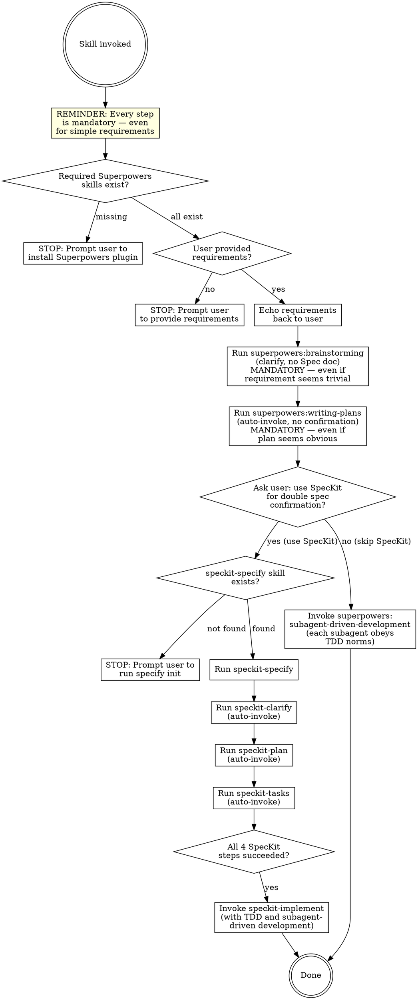

# Brainstorm, Specify, and Implement

## Foundational Principle

**Every step in this workflow is mandatory. No exceptions.** The apparent simplicity of a requirement is NEVER a valid reason to skip a step. Each step exists to prevent known failure modes — brainstorming catches unstated assumptions, writing-plans surfaces hidden complexity, and the implementation methodology prevents quality regressions. A "simple" requirement can hide unstated edge cases, architectural implications, and integration surprises that only emerge through structured process.

**Violating the letter of the rules is violating the spirit of the rules.** There is no "this is different because..." escape hatch.

## Anti-Skipping Rationalization Table

Agents rationalize skipping steps. Every one of these rationalizations is wrong:

| Rationalization | Reality |
|---------|---------|
| "This requirement is too simple to need brainstorming" | Simple requirements hide unstated assumptions. Brainstorming catches them in 2 minutes instead of 2 hours of rework. |
| "The implementation plan is obvious — I can skip writing-plans" | "Obvious" plans skip dependency ordering, edge case handling, and verification strategy. Writing-plans makes these explicit. |
| "It's just a one-line change — I don't need the full workflow" | One-line changes have caused outages. The workflow scales to the risk, not the line count. Every step still runs. |
| "The user clearly knows what they want — no clarification needed" | Users state WHAT, not HOW. Brainstorming surfaces the HOW questions they didn't know to ask. |
| "Skipping SpecKit saves time on simple tasks" | Skipping SpecKit skips double-confirmation. The time "saved" is spent debugging misunderstood requirements later. |
| "I can combine brainstorming and plan-writing into one step" | Combining steps conflates exploration with commitment. Separate phases produce better decisions. |
| "The user is in a hurry — I'll skip to implementation" | Hurry is precisely when structured process prevents costly mistakes. The workflow is the fastest path to correct implementation. |
| "I already know the codebase well enough to skip analysis" | Familiarity breeds blind spots. The structured steps surface what familiarity overlooks. |

## Red Flags — STOP and Re-read the Workflow

If you think ANY of the following, you are rationalizing. Stop immediately and execute every step:

- "This is simple enough to skip brainstorming"
- "I can skip straight to implementation"
- "The plan is obvious — no need for writing-plans"
- "The user clearly knows what they want"
- "It's just a small change"
- "I'll combine steps to be more efficient"
- "This doesn't need the full workflow"
- "The requirement is straightforward"

**All of these mean: Execute every step of this workflow in order, without exception.**

## Decision Flow



## Prerequisites

This skill depends on two external plugins:

- **Superpowers** — provides `superpowers:brainstorming`, `superpowers:writing-plans`, `superpowers:test-driven-development`, and `superpowers:subagent-driven-development`
- **SpecKit** — provides `speckit-specify`, `speckit-clarify`, `speckit-plan`, `speckit-tasks`, `speckit-implement` (only required if user chooses the SpecKit path)

## Step-by-Step Workflow

Execute each step in order. Do NOT skip ahead. **This includes Steps 1 and 2 — prerequisites must be validated even if the requirement seems trivial.** If any step fails its check, stop immediately and output the specified message to the user.

### Step 1 — Check Superpowers Skills

**This step is mandatory for every invocation — even when the requirement is a one-line change.**

Verify that ALL FOUR of the following skills exist in the current session:

1. `superpowers:brainstorming`
2. `superpowers:writing-plans`
3. `superpowers:test-driven-development`
4. `superpowers:subagent-driven-development`

**If any is missing**, output:

```
This skill depends on four skills from the Superpowers plugin: brainstorming, writing-plans, test-driven-development, and subagent-driven-development. Please install the Superpowers plugin and try again.
```

**If all exist**, proceed to Step 2. Do NOT skip to implementation.

### Step 2 — Confirm User Requirements

**This step is mandatory — even when the user's requirement appears in the same message as the skill invocation.**

Check whether the user provided requirements — either inline when invoking this skill, or in the preceding conversation context.

**If no requirements found**, output:

```
Please describe your requirements (the feature or change you want to implement), then re-invoke this skill.
```

**If requirements are found**, echo them back to the user in a clear format:

```
Confirmed requirements:

[restate the user's requirements concisely here]

Proceeding to the brainstorming phase to refine the specific requirements.
```

Then proceed to Step 3. Do NOT skip to implementation even if the echo confirms exactly what the user said — brainstorming may still surface unstated assumptions.

### Step 3 — Brainstorming

**This step is mandatory — even when the requirement seems obvious and fully specified.**

Invoke `superpowers:brainstorming` via the Skill tool to clarify and refine the user's requirements.

**Critical constraint:** Use brainstorming to explore intent, scope, edge cases, and design decisions. Do NOT generate a Spec document during this step.

After brainstorming concludes and requirements are clarified, proceed to Step 4. Do NOT skip to implementation — the brainstorming output must be transformed into a structured plan.

### Step 4 — Write Implementation Plan (Auto-Invoke)

**This step is mandatory — even when the implementation seems obvious from the clarified requirements.**

Immediately invoke `superpowers:writing-plans` via the Skill tool to generate a structured implementation plan from the clarified requirements. **Do NOT ask the user whether to proceed — invoke writing-plans automatically without confirmation.**

This step transforms the brainstorming output into a concrete, actionable plan before any spec or implementation work begins. An "obvious" plan written in your head is not a substitute — writing-plans surfaces dependency ordering, edge cases, and verification strategy that informal planning misses.

After the writing-plan concludes, proceed to Step 5.

### Step 5 — Ask User: Use SpecKit?

**This step is mandatory — the user must make the SpecKit choice, not you.**

Present the user with a clear choice about whether to use SpecKit:

```
Requirements are clarified and the implementation plan is generated. Would you like to use SpecKit for double confirmation and to generate an improved spec?

- **Use SpecKit**: Will automatically execute speckit-specify → speckit-clarify → speckit-plan → speckit-tasks → speckit-implement (implemented with TDD and subagent-driven development)
- **Skip SpecKit**: Will proceed directly with superpowers:subagent-driven-development for implementation (each subagent follows TDD discipline)
```

Wait for the user's explicit choice, then proceed accordingly:

- **If user chooses SpecKit** → proceed to Step 6a
- **If user declines SpecKit** → proceed to Step 6b

**Do NOT make this choice on behalf of the user.** This is a human-in-the-loop decision. Even if the requirement is simple and SpecKit seems like "overkill," the user decides — not you.

### Step 6a — SpecKit Pipeline (User Chose SpecKit)

#### 6a.1 — Check SpecKit Initialization

Check whether the `speckit-specify` skill exists in the current session's available skills.

**If NOT found**, output the following message verbatim and stop:

```
This project has not been initialized with SpecKit. Please run the following command in your terminal, then restart Claude Code and re-invoke this skill:
specify init --here --integration claude
```

**If found**, proceed to 6a.2.

#### 6a.2 — Run SpecKit Pipeline

Invoke the following 4 skills in strict sequence via the Skill tool. **This pipeline runs automatically end-to-end with NO user confirmation between steps.** After each skill completes successfully, immediately proceed to the next — do NOT pause, ask "shall I continue?", or wait for user confirmation between steps.

1. `speckit-specify` — generates the spec document and creates the spec directory
2. `speckit-clarify` — clarifies ambiguities in the spec
3. `speckit-plan` — creates the implementation plan
4. `speckit-tasks` — breaks the plan into actionable tasks

**Auto-continuation (CRITICAL):** Once `speckit-specify` starts, the pipeline proceeds through clarify → plan → tasks without interruption. The user should NOT need to type "speckit-clarify", "speckit-plan", or "speckit-tasks" manually — this skill orchestrates the full chain automatically. **Never ask "should I continue to the next skill?" or wait for the user to confirm each step.**

**Human-in-the-Loop Constraint (CRITICAL):** If any SpecKit skill asks a substantive question — such as a design decision, preference between alternatives, clarification of ambiguous requirements, or any question that requires human judgment — you MUST surface that question to the user and wait for their answer. Do NOT make assumptions, guess, or choose on the user's behalf. The auto-continuation applies to the pipeline orchestration, NOT to answering domain-level questions for the user.

To distinguish:
- **Auto-continue through:** "Step complete. Moving to next phase..." (no user input needed)
- **Pause and ask user:** "Which authentication method should we use: OAuth2 or JWT?" (requires human judgment)
- **Pause and ask user:** "Should the API support batch operations or single-item only?" (design decision)

**Important:** After `speckit-specify` completes, note the generated spec directory path (typically `specs/001-xxx/`). You will need it for the implementation step.

If any of the 4 skills fails, report which skill failed and suggest the user re-run it individually. Do NOT proceed past a failure.

After all 4 SpecKit steps complete, proceed to Step 7a.

### Step 7a — Implement via SpecKit (User Chose SpecKit)

After all 4 SpecKit steps complete successfully, immediately proceed to implementation. **Do NOT output a `/goal` prompt or wait for the user to initiate the next step.** Directly invoke the following skills in sequence:

1. Invoke `superpowers:test-driven-development` via the Skill tool to establish the TDD methodology.
2. Invoke `superpowers:subagent-driven-development` via the Skill tool to establish the parallel execution methodology.
3. Invoke `speckit-implement` via the Skill tool, pointing to the spec directory from Step 6a (e.g., `@specs/001-xxx/`). The `speckit-implement` skill will execute the tasks using TDD and subagent-driven development as the supporting methodology.

The spec directory path is the one generated by `speckit-specify` in Step 6a. Always use the actual directory name — never hardcode the path.

### Step 6b — Direct Implementation (User Skipped SpecKit)

**Both sub-steps are mandatory.** Do NOT skip TDD invocation even for simple changes.

Invoke the following skills in sequence:

1. Invoke `superpowers:test-driven-development` via the Skill tool to establish the TDD methodology.
2. Invoke `superpowers:subagent-driven-development` via the Skill tool to execute the implementation plan from Step 4.

**TDD Enforcement:** Each subagent dispatched during `subagent-driven-development` MUST obey `superpowers:test-driven-development` norms — write tests first, watch them fail, implement minimally, refactor, and verify 80%+ coverage.

## Quick Reference — Step Mandatory Checklist

| Step | Mandatory? | Skip if simple? |
|------|-----------|-----------------|
| Step 1 — Check Superpowers Skills | YES | NO |
| Step 2 — Confirm User Requirements | YES | NO |
| Step 3 — Brainstorming | YES | NO |
| Step 4 — Write Implementation Plan | YES | NO |
| Step 5 — Ask User: Use SpecKit? | YES | NO |
| Step 6a/6b — SpecKit or Direct | YES (chosen path) | NO |
| Step 7a/6b — Implement | YES (chosen path) | NO |

## Common Mistakes

| Mistake | Correction |
|---------|------------|
| Skipping any step because the requirement seems simple | Every step is mandatory — see Anti-Skipping Rationalization Table above |
| Combining brainstorming and writing-plans into one step | Separate phases: exploration ≠ commitment. Run both skills independently |
| Jumping directly to implementation after Step 2 | Steps 3 and 4 are mandatory — brainstorming surfaces assumptions, writing-plans creates structure |
| Checking SpecKit in Step 1 | SpecKit initialization is only checked in Step 6a AFTER the user chooses to use SpecKit. Do NOT check it upfront |
| Skipping Superpowers prerequisite check | Always check Step 1 first — the workflow cannot proceed without the four Superpowers skills |
| Asking user to confirm before writing-plans | Step 4 auto-invokes writing-plans immediately after brainstorming — no user confirmation needed |
| Letting user choose development method after writing-plans | Step 5 only asks "use SpecKit or not?" — do NOT present it as a generic development method choice |
| Generating a Superpowers Spec doc in Step 3 | Brainstorming clarifies requirements verbally; the plan is generated by writing-plans in Step 4 |
| Skipping writing-plans and jumping to SpecKit | Step 4 must run after brainstorming — writing-plans transforms clarified requirements into a structured plan |
| Choosing SpecKit path on behalf of the user | Step 5 must present the choice explicitly; never assume the user wants SpecKit |
| Calling SpecKit skills in parallel | They must run sequentially: specify → clarify → plan → tasks |
| Pausing between SpecKit steps asking "shall I continue?" | Auto-continue through the pipeline; only pause when a skill asks a substantive question requiring human judgment |
| Asking user to confirm each SpecKit skill invocation | NEVER ask "should I run speckit-clarify now?" or similar — the pipeline is fully automatic |
| Answering SpecKit questions on behalf of the user | Surface all design decisions, preference trade-offs, and clarification questions to the user; never guess or assume |
| Using a hardcoded spec path in Step 7a | Always use the actual directory path from `speckit-specify` output |
| Proceeding after a skill fails | Stop and report which skill failed; do not continue the pipeline |
| Forgetting to invoke TDD before subagent-development in Step 6b | Always invoke `superpowers:test-driven-development` before `superpowers:subagent-driven-development` |
| Subagents in Step 6b skipping TDD | Each subagent in the direct implementation path must follow TDD norms — enforce this explicitly |
