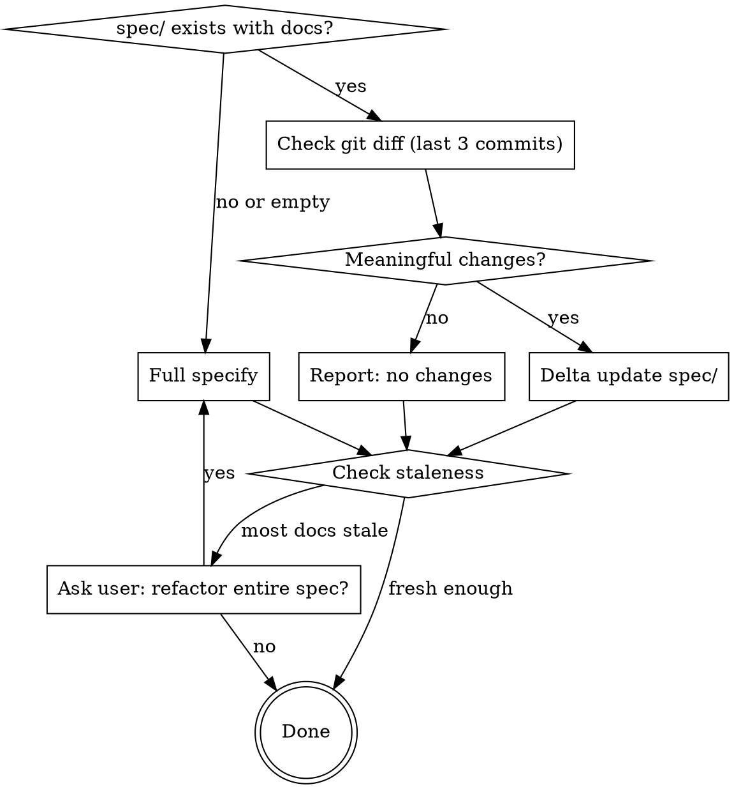

# Specify

Generate or incrementally update project specification documents from the codebase into `spec/`.

## Decision Flow



## Hard Rules (non-negotiable)

1. **AI-reimplementable fidelity.** Every spec must be detailed enough that another AI agent, given *only* the spec folder, can re-implement the entire project from scratch without reading the original source code.

2. **Output directory is `spec`.** All generated documents live under `spec/` — not `docs/`, not `specs/`, not any other name.

3. **Delta-only when possible.** If `spec/` already contains detailed documentation, do NOT regenerate from scratch. Use git diff to detect changes and update only affected documents.

4. **Preserve manual edits.** When updating an existing spec file, preserve manually written sections. Only update content that corresponds to changed source code.

5. **No source code in specs.** Never include raw source code (no code blocks with implementation). Use mermaid diagrams for logic flow, and natural language for module/function descriptions. The spec describes *what* and *why*, never the literal *how* of the code.

6. **Modification history on every doc.** Every document under `spec/` must begin with a modification history table (see Modification History format below).

## Prerequisites

This skill depends on the **everything-claude-code** plugin:

```
/plugin marketplace add https://github.com/affaan-m/everything-claude-code
/plugin install everything-claude-code@everything-claude-code
```

## Modification History Format

Every document file under `spec/` must include a modification history table at the very beginning (after any YAML frontmatter, before the main heading). Use this exact format:

```markdown
## Modification History

| Time | Version | Description | Operator |
|------|---------|-------------|----------|
| 2026-05-20 10:30 | v1.0.0 | Initial specification generated | ATreep |
| 2026-05-21 14:15 | v1.1.0 | Added error handling flow to data-pipeline module | ATreep |
```

Rules for the history table:
- **Time**: ISO date + time of the modification (`YYYY-MM-DD HH:MM`).
- **Version**: Semantic version (`MAJOR.MINOR.PATCH`). MAJOR for spec rewrites, MINOR for new sections/modules, PATCH for fixes and clarifications.
- **Description**: Brief one-line summary of what changed.
- **Operator**: Git username of the person who made the change. Obtain via `git config user.name` or `git log -1 --format='%an'`. If no git username is available, use the system username.
- On every delta update, append a new row to the table. Never remove or modify existing rows.

## Spec Directory Structure

The spec directory uses a multi-level sub-folder hierarchy. Each module (or tightly related module group) gets its own sub-folder under `spec/modules/`:

```
spec/
├── README.md                          # Navigation index for all specs
├── PRD.md                             # Product Requirements Document
├── architecture.md                    # System structure, boundaries, and flow
├── runtime.md                         # Setup, scripts, execution model, env/config
├── data-model.md                      # Storage schemas, entities, and relationships
├── integrations.md                    # Third-party APIs/services and interaction contracts
├── operations.md                      # Deploy/runbook, health checks, failure/rollback paths
├── implementation-guide.md            # End-to-end rebuild blueprint
├── modules.md                         # Module catalog with coverage matrix
└── modules/
    ├── auth/                          # Example: authentication module
    │   ├── README.md                  # Module overview, responsibility, design objectives & flaws
    │   ├── login-flow.md              # Login sub-module spec
    │   ├── token-management.md        # Token sub-module spec
    │   └── session-handling.md        # Session sub-module spec
    ├── data-pipeline/
    │   ├── README.md                  # Module overview
    │   ├── ingestion.md               # Data ingestion sub-module
    │   ├── transformation.md          # Data transform sub-module
    │   └── export.md                  # Export sub-module
    └── ui/
        ├── README.md                  # Module overview
        ├── dashboard.md               # Dashboard component spec
        └── settings.md                # Settings component spec
```

### Folder Naming Rules

- Each module folder lives under `spec/modules/`.
- Folder name: kebab-case, derived from the module's domain or source path (e.g., `auth`, `data-pipeline`, `api-handlers`).
- Each folder MUST contain a `README.md` with the module overview, design objectives, and known flaws.
- Sub-modules or sub-features within the module become additional `.md` files inside the same folder.
- If a sub-module is complex enough, it can itself become a sub-folder (nested hierarchy is allowed).

## Core Rules

- Prefer multiple focused files over a single large file.
- Cover **all code modules** in scope: `.py`, `.html`, `.js`, `.ts`, `.tsx`, `.jsx`, `.java`, `.sh`, `.go`, `.rs`, `.php`, `.rb`, `.cs`, `.kt`, `.swift`, `.sql`, `.yaml`, `.yml`.
- Documentation must be detailed enough that Claude Code can implement the full project from specs alone.
- Derive specs from source-of-truth files and code; avoid inventing behavior.
- Use `everything-claude-code:plan` to draft a plan before your actions.
- **No source code** — represent logic with mermaid diagrams (flowchart, sequence, class, state, ER) and describe behavior in natural language. Pseudocode is acceptable only for complex algorithms where natural language alone is ambiguous.

## Mode 1: Full Specify (no existing spec/)

Run when `spec/` does not exist or is empty.

### Workflow

1. **Inventory the codebase**
   - Identify project type(s), runtimes, entry points, module boundaries, and infra files.
   - Build a complete module index for all relevant source files in scope.
   - Map modules to a sub-folder hierarchy under `spec/modules/`.

2. **Map architecture and behavior**
   - Trace request/data/control flow across layers.
   - Capture dependencies, external services, config/env requirements, scripts/commands, and operational behavior.
   - Represent all flows as mermaid diagrams.

3. **Generate `spec/` set**
   - `spec/PRD.md` — Product Requirements Document (see PRD section below).
   - `spec/README.md` — navigation index for all generated specs.
   - `spec/architecture.md` — system structure, boundaries, and flow (mermaid diagrams).
   - `spec/modules.md` — module catalog with purpose, ownership by path, and coverage matrix.
   - `spec/runtime.md` — setup, scripts, execution model, env/config.
   - `spec/data-model.md` — storage schemas, entities, and relationships (mermaid ER diagrams).
   - `spec/integrations.md` — third-party APIs/services and interaction contracts.
   - `spec/operations.md` — deploy/runbook, health checks, failure/rollback paths.
   - `spec/implementation-guide.md` — end-to-end rebuild blueprint.
   - `spec/modules/<module-name>/README.md` — module overview for each module.
   - `spec/modules/<module-name>/<sub-module>.md` — one file per sub-module or feature within the module.

4. **PRD Requirements**

   The `spec/PRD.md` must contain:

   - **System Overview**: What the system does, who uses it, and why it exists.
   - **Capabilities**: High-level list of everything the system can do, organized by module.
   - **Module Design Objectives**: For each module in `spec/modules/`, document:
     - What problem it solves.
     - What it was designed to achieve.
     - Known design flaws, limitations, or trade-offs.
   - **User Stories / Use Cases**: Key scenarios the system supports.
   - **Non-Functional Requirements**: Performance, security, scalability constraints.
   - **Out of Scope**: Explicitly list what the system does NOT do.

5. **Per-module documentation requirements**

   Each module sub-folder (`spec/modules/<module-name>/`) must include:

   - `README.md` with:
     - Module responsibility and scope.
     - Design objectives and known flaws.
     - Dependencies on other modules.
     - Modification history table.
   - One `.md` per sub-module or feature, each containing:
     - File path(s) and responsibility.
     - Public interfaces (functions/classes/endpoints/CLI commands) — described in natural language, not code.
     - Inputs/outputs, side effects, and invariants.
     - Internal dependencies and call relationships (mermaid sequence/flowchart diagrams).
     - Error handling and edge cases.
     - Security considerations and validation boundaries.
     - Reimplementation notes (what must be preserved for parity).
     - Modification history table.

6. **Logic Representation (mermaid)**

   Use mermaid diagrams to represent all logic. Required diagram types:

   | Logic Type | Mermaid Diagram |
   |------------|----------------|
   | Request/data flow | `flowchart TD` or `flowchart LR` |
   | Component interactions | `sequenceDiagram` |
   | Data entities & relationships | `erDiagram` |
   | State machines | `stateDiagram-v2` |
   | Class/module structure | `classDiagram` |
   | System boundaries | `flowchart` with subgraphs |

   Every module README must include at least one flowchart showing the module's internal flow.

7. **Coverage validation**
   - Produce a coverage matrix in `spec/modules.md` mapping every discovered source module to a documentation target folder.
   - Explicitly list any skipped/generated/vendor files and the reason.
   - If coverage is incomplete, continue until all in-scope modules are documented.

8. **Staleness and provenance**
   - Add generated markers and scan metadata (date, scope, files scanned).
   - Preserve manually written sections when updating existing specs.

9. **Final summary**
   - Report created/updated files in `spec`.
   - Report module coverage totals and any intentional exclusions.

## Mode 2: Delta Update (spec/ already exists)

Run when `spec/` exists with detailed documentation.

### Workflow

1. **Detect Changes (git diff, last 3 commits)**

   ```bash
   git diff HEAD~3..HEAD --name-status
   ```

   - Focus on source files only. Ignore non-source files (`.md`, `.gitignore`, lock files, config files that don't affect behavior).
   - If there are also uncommitted changes, include them: `git diff HEAD --name-status`.
   - Default depth is 3 commits. User can override by passing a different range.

   If no meaningful source changes are found, report this and stop.

2. **Map Changes to Spec Files**

   For each changed source file:
   - Look up the corresponding spec folder in `spec/modules/<module-name>/`.
   - Check whether the change affects other spec files (`architecture.md`, `data-model.md`, `integrations.md`, `PRD.md`, etc.).
   - If a changed module has no corresponding spec folder yet, flag it as **new** — create the folder and README.md.
   - If a spec folder exists but the source module was deleted, flag it for removal or archival.

3. **Read and Analyze Affected Specs**

   For each spec file that needs updating:
   - Read the current spec content.
   - Read the corresponding source code (current state).
   - Identify what has changed and which sections of the spec are now stale.

4. **Update Specs (delta only)**

   Apply targeted updates:
   - **Modified modules** — update relevant sections in the module's spec files.
   - **New modules** — create `spec/modules/<module-name>/README.md` and sub-module specs following per-module documentation requirements.
   - **Deleted modules** — mark archived or remove if appropriate.
   - **Cross-cutting changes** — update `architecture.md`, `data-model.md`, `integrations.md`, `PRD.md`, or `operations.md` if affected.
   - **Coverage matrix** — update `spec/modules.md` if modules were added or removed.
   - **PRD** — update design objectives/flaws in `spec/PRD.md` if module behavior changed.
   - **Index** — update `spec/README.md` if new spec files/folders were added or removed.
   - **Modification history** — append a new row to the history table in every affected document. Use git username from `git config user.name`.

5. **Final Summary**

   Report:
   - Source files detected as changed.
   - Spec files/folders updated/created/archived.
   - Modules skipped (non-source, vendor, generated) and why.
   - If no specs needed updating, say so explicitly.

## Staleness Check (both modes)

After completing either mode, compare spec freshness against the project:

1. Get the newest modification time among spec files: `find spec -name '*.md' -exec stat -f '%m' {} \; | sort -rn | head -1`
2. Get the newest modification time among source files (exclude `spec/`, `node_modules/`, `.git/`): `find . -name '*.ts' -o -name '*.py' -o -name '*.go' ... | xargs stat -f '%m' | sort -rn | head -1`
3. If most spec documents are significantly older than the newest source files (e.g., >7 days gap), ask the user:

   > Most spec documents haven't been updated in a while compared to recent source changes. Would you like me to refactor the entire spec from scratch?

   - If yes → switch to Mode 1 (full specify).
   - If no → stop.

## Output Quality Bar

The specification must provide enough architectural, interface, and behavioral detail for full-project reconstruction without reading the original code — whether generated fresh or updated incrementally. Logic must be expressed through mermaid diagrams and natural language descriptions, never raw source code.
