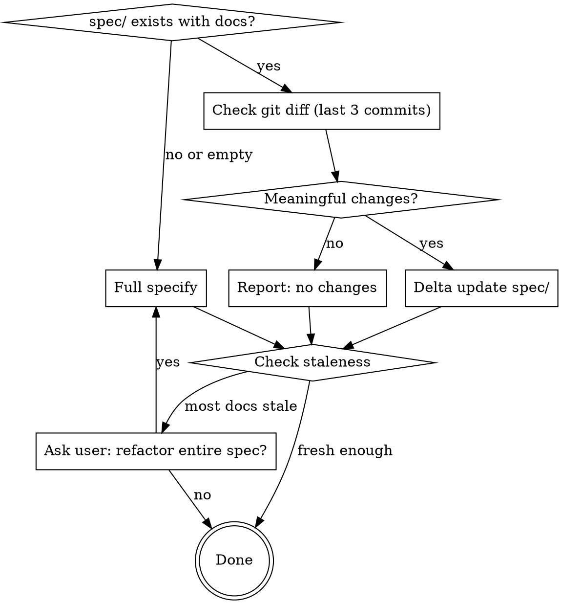

# Specify

Generate or incrementally update project specification documents from the codebase into `spec/`.

## Decision Flow



## Hard Rules (non-negotiable)

1. **AI-reimplementable fidelity.** Every spec must be detailed enough that another AI agent, given *only* the spec folder, can re-implement the entire project from scratch without reading the original source code.

2. **Output directory is `spec`.** All generated documents live under `spec/` — not `docs/`, not `specs/`, not any other name.

3. **Delta-only when possible.** If `spec/` already contains detailed documentation, do NOT regenerate from scratch. Use git diff to detect changes and update only affected documents.

4. **Preserve manual edits.** When updating an existing spec file, preserve manually written sections. Only update content that corresponds to changed source code.

## Prerequisites

This skill depends on the **everything-claude-code** plugin:

```
/plugin marketplace add https://github.com/affaan-m/everything-claude-code
/plugin install everything-claude-code@everything-claude-code
```

## Core Rules

- Prefer multiple focused files over a single large file.
- Cover **all code modules** in scope: `.py`, `.html`, `.js`, `.ts`, `.tsx`, `.jsx`, `.java`, `.sh`, `.go`, `.rs`, `.php`, `.rb`, `.cs`, `.kt`, `.swift`, `.sql`, `.yaml`, `.yml`.
- Documentation must be detailed enough that Claude Code can implement the full project from specs alone.
- Derive specs from source-of-truth files and code; avoid inventing behavior.
- Use `everything-claude-code:plan` to draft a plan before your actions.

## Mode 1: Full Specify (no existing spec/)

Run when `spec/` does not exist or is empty.

### Workflow

1. **Inventory the codebase**
   - Identify project type(s), runtimes, entry points, module boundaries, and infra files.
   - Build a complete module index for all relevant source files in scope.

2. **Map architecture and behavior**
   - Trace request/data/control flow across layers.
   - Capture dependencies, external services, config/env requirements, scripts/commands, and operational behavior.

3. **Generate `spec/` set (small, focused files)**
   - `spec/README.md` — navigation index for all generated specs.
   - `spec/architecture.md` — system structure, boundaries, and flow.
   - `spec/modules.md` — module catalog with purpose and ownership by path.
   - `spec/runtime.md` — setup, scripts, execution model, env/config.
   - `spec/data-model.md` — storage schemas, entities, and relationships.
   - `spec/integrations.md` — third-party APIs/services and interaction contracts.
   - `spec/operations.md` — deploy/runbook, health checks, failure/rollback paths.
   - `spec/implementation-guide.md` — end-to-end rebuild blueprint.
   - `spec/modules/<path-safe-module-name>.md` — one file per significant module or tightly related module group.

4. **Per-module documentation requirements**
   For each documented module, include:
   - File path(s) and responsibility.
   - Public interfaces (functions/classes/endpoints/CLI commands).
   - Inputs/outputs, side effects, and invariants.
   - Internal dependencies and call relationships.
   - Error handling and edge cases.
   - Security considerations and validation boundaries.
   - Reimplementation notes (what must be preserved for parity).

5. **Coverage validation**
   - Produce a coverage matrix in `spec/modules.md` mapping every discovered source module to a documentation target.
   - Explicitly list any skipped/generated/vendor files and the reason.
   - If coverage is incomplete, continue until all in-scope modules are documented.

6. **Staleness and provenance**
   - Add generated markers and scan metadata (date, scope, files scanned).
   - Preserve manually written sections when updating existing specs.

7. **Final summary**
   - Report created/updated files in `spec`.
   - Report module coverage totals and any intentional exclusions.

## Mode 2: Delta Update (spec/ already exists)

Run when `spec/` exists with detailed documentation.

### Workflow

1. **Detect Changes (git diff, last 3 commits)**

   ```bash
   git diff HEAD~3..HEAD --name-status
   ```

   - Focus on source files only. Ignore non-source files (`.md`, `.gitignore`, lock files, config files that don't affect behavior).
   - If there are also uncommitted changes, include them: `git diff HEAD --name-status`.
   - Default depth is 3 commits. User can override by passing a different range.

   If no meaningful source changes are found, report this and stop.

2. **Map Changes to Spec Files**

   For each changed source file:
   - Look up the corresponding spec file in `spec/modules/` (follows `<path-safe-module-name>.md` naming).
   - Check whether the change affects other spec files (`architecture.md`, `data-model.md`, `integrations.md`, etc.).
   - If a changed module has no corresponding spec file yet, flag it as **new** — create it.
   - If a spec file exists but the source module was deleted, flag it for removal or archival.

3. **Read and Analyze Affected Specs**

   For each spec file that needs updating:
   - Read the current spec content.
   - Read the corresponding source code (current state).
   - Identify what has changed and which sections of the spec are now stale.

4. **Update Specs (delta only)**

   Apply targeted updates:
   - **Modified modules** — update relevant sections in `spec/modules/*.md`.
   - **New modules** — create `spec/modules/<module-name>.md` following per-module documentation requirements.
   - **Deleted modules** — mark archived or remove if appropriate.
   - **Cross-cutting changes** — update `architecture.md`, `data-model.md`, `integrations.md`, or `operations.md` if affected.
   - **Coverage matrix** — update `spec/modules.md` if modules were added or removed.
   - **Index** — update `spec/README.md` if new spec files were added or removed.
   - **Provenance** — update scan metadata in affected files.

5. **Final Summary**

   Report:
   - Source files detected as changed.
   - Spec files updated/created/archived.
   - Modules skipped (non-source, vendor, generated) and why.
   - If no specs needed updating, say so explicitly.

## Staleness Check (both modes)

After completing either mode, compare spec freshness against the project:

1. Get the newest modification time among spec files: `find spec -name '*.md' -exec stat -f '%m' {} \; | sort -rn | head -1`
2. Get the newest modification time among source files (exclude `spec/`, `node_modules/`, `.git/`): `find . -name '*.ts' -o -name '*.py' -o -name '*.go' ... | xargs stat -f '%m' | sort -rn | head -1`
3. If most spec documents are significantly older than the newest source files (e.g., >7 days gap), ask the user:

   > Most spec documents haven't been updated in a while compared to recent source changes. Would you like me to refactor the entire spec from scratch?

   - If yes → switch to Mode 1 (full specify).
   - If no → stop.

## Output Quality Bar

The specification must provide enough architectural, interface, and behavioral detail for full-project reconstruction without reading the original code — whether generated fresh or updated incrementally.
